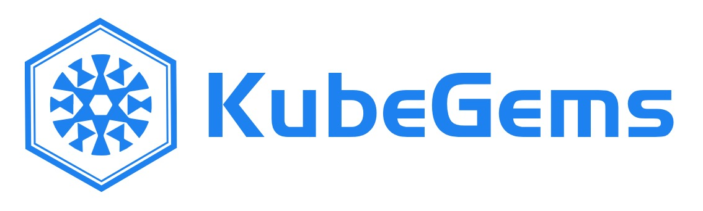
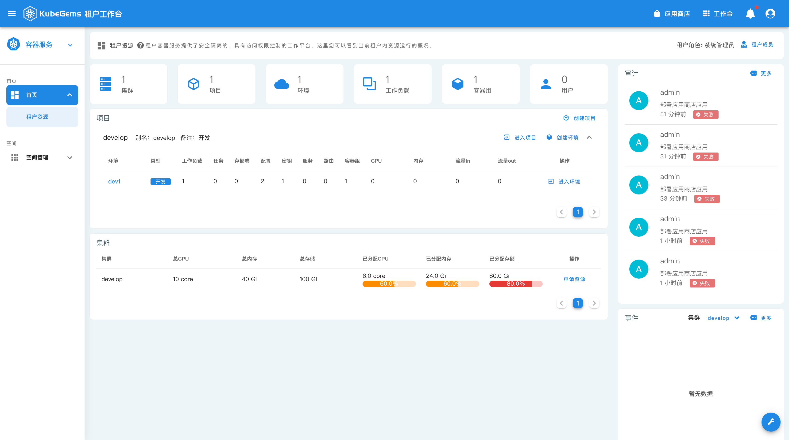

<p align="center">
  <a href="https://kubegems.io" target="_blank">
    
  </a>
</p>

<p align="center">
  <a href="https://github.com/kubegems/dashboard/actions">
    
  </a>
  <a href="https://opensource.org/licenses/Apache-2.0">
    
  </a>
</p>

<p align="center">
  
</p>

## Introduction

KubeGems is a full-stack application platform for Kubernetes automated operation, maintenance, operation and manufacturing. It supports multi-cluster management, provides cloud computing stack capabilities, and provides IT DevOps workflows and workflows.

KubeGems Dashboard is the web interface for [KubeGems](https://github.com/kubegems/kubegems).

## How to build

### Requirement

#### Node.js

Node.js is required. If you don't have a Node.js development environment, please [set it up](https://nodejs.org/en/download/). The minimum version required is 16.

#### Yarn

We use [Yarn](https://yarnpkg.com/) to do package management. If you don't have yarn, use the following to install:

```sh
npm install -g yarn@1.22.17
```

The minimum version required is 1.22.17, but you can use a newer version.

Clone the repository, and run `yarn && yarn build`

```sh
git clone https://github.com/kubegems/dsahboard.git
cd dashboard/
yarn && yarn build
yarn serve
```

## Documentation

To check out [live demo](http://47.108.158.85/) and docs, visit [kubegems.io](https://kubegems.io).

## Issues

Please make sure to read the [Issue Template](https://github.com/kubegems/dashboard/blob/main/.github/ISSUE_TEMPLATE.md) and [Pull Request Template](https://github.com/kubegems/dashboard/blob/main/.github/PULL_REQUEST_TEMPLATE.md) before opening an issue or create PR.

## Changelog

Detailed changes for each release are documented in the [release notes](https://github.com/kubegems/dashboard/releases).

### 📑 License

[Apache-2.0](https://opensource.org/licenses/Apache-2.0)

Copyright (c) 2021-present Kubegems.io
